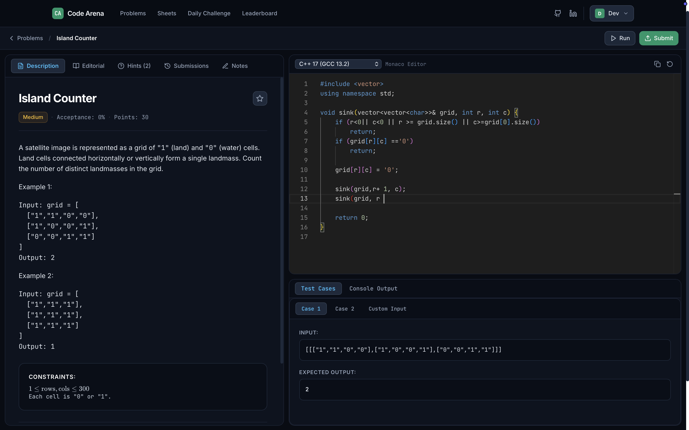
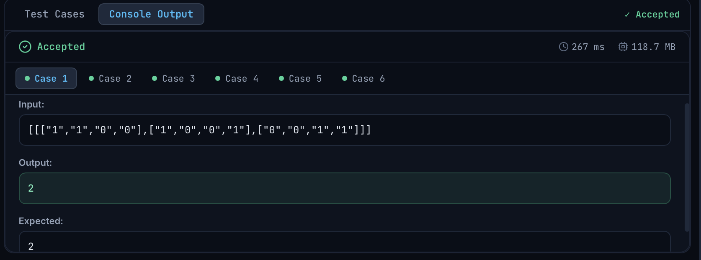
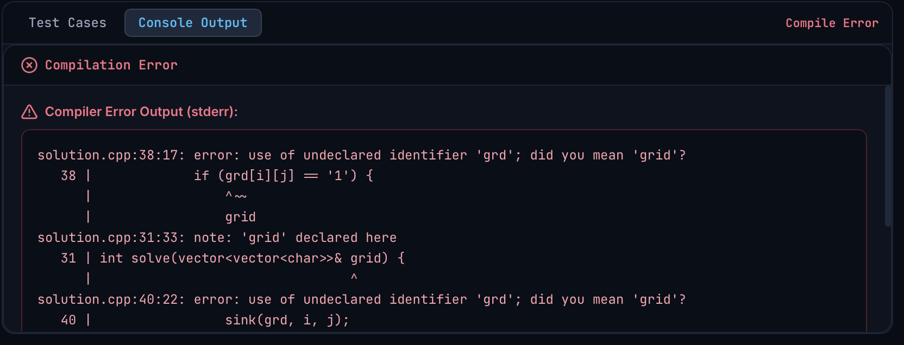
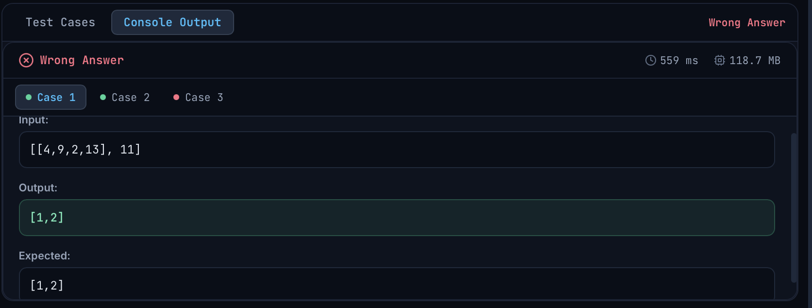

# Code Arena

An online judge and coding practice platform built with React, TypeScript, FastAPI, and Docker. It lets users solve algorithmic problems in an isolated environment with real-time feedback across Python, C++, Java, and JavaScript.

[](https://opensource.org/licenses/MIT)
[](https://www.python.org/downloads/)
[](https://fastapi.tiangolo.com/)
[](https://reactjs.org/)
[](https://www.typescriptlang.org/)
[](./backend/test_judge_engine.py)

---

## Preview



---

## Features

- **Code Workspace**: Split-panel interface featuring Monaco Editor, syntax highlighting, multi-language starter templates, and LaTeX formula rendering for problem statements.
- **Multi-Language Judge**: Executes user code across Python 3.11, C++ 17, Java 17, and Node.js 20 with configurable time and memory limits.
- **Compiler Error Reporting**: Preserves raw compiler `stderr` output and stack traces so users can debug syntax errors directly.
- **Output Comparator**: Normalizes line endings, strips trailing newlines, and handles order-independent array comparisons (e.g., 3Sum) and floating-point tolerances.
- **Company Sheets**: Curated problem lists for Google, Amazon, Meta, and Top 150 interview patterns.
- **Progress Tracking**: Activity heatmaps, submission history, and topic breakdown.
- **Admin CMS**: Problem creation wizard with test case management and multi-language configuration.

---

## Architecture

```
Browser (React + Monaco Editor)
      │
      ▼
 FastAPI Backend (Auth, Problems, Submissions)
      │
      ▼
 Judge Execution Service
      │
 ┌────┴───────────────────────────┐
 │                                │
 ▼                                ▼
Docker Sandbox            Local Subprocess
(--network none)          (Process Group Isolation)
 │                                │
 └────────────────┬───────────────┘
                  ▼
          Compilation Stage
       (g++, javac, py_compile)
                  │
                  ▼
          Execution Runtime
       (Time & Memory Limits)
                  │
                  ▼
          Output Comparator
       (Normalization & Floats)
                  │
                  ▼
          Verdict & Results
       (AC, WA, TLE, MLE, CE)
```

---

## Tech Stack

| Layer | Technologies |
| :--- | :--- |
| **Frontend** | React 18, TypeScript, Vite, Monaco Editor, Tailwind CSS, KaTeX, Recharts |
| **Backend** | Python 3.11+, FastAPI, SQLAlchemy 2.0, Pydantic v2, PyJWT, bcrypt |
| **Database** | SQLite (development) / PostgreSQL (production) |
| **Execution** | Docker containers (`--network none`, `--read-only`, `--pids-limit`) / Subprocesses |
| **Testing** | Pytest, 50-test automated judge suite |

---

## Screenshots

### 1. Accepted Submission

*Accepted verdict displaying execution runtime, memory usage, and passed test cases.*

---

### 2. Compilation Error

*Direct compiler error diagnostics showing raw compiler stderr to help debug syntax issues.*

---

### 3. Wrong Answer

*Detailed test case failure view highlighting differences between expected and actual output.*

---

## Project Structure

```text
code-arena/
├── backend/
│   ├── app/
│   │   ├── core/           # Database config, auth & security
│   │   ├── judge/          # Execution runner, normalizer & language configs
│   │   ├── models/         # SQLAlchemy models
│   │   ├── routers/        # API route handlers
│   │   ├── schemas/        # Pydantic schemas
│   │   └── services/       # Business logic & demo seed data
│   ├── test_judge_engine.py # 50-test judge verification suite
│   ├── requirements.txt
│   └── Dockerfile
├── frontend/
│   ├── src/
│   │   ├── api/            # Typed API client
│   │   ├── components/     # Monaco editor, tabs, test case panel, charts
│   │   ├── pages/          # Workspace, Problems, Sheets, Dashboard, Admin
│   │   └── types/          # TypeScript definitions
│   ├── package.json
│   └── vite.config.ts
├── screenshots/            # UI screenshots
└── README.md
```

---

## Getting Started

### Prerequisites
- Node.js 18+ and npm
- Python 3.11+
- (Optional) Docker for containerized sandboxing

### 1. Backend Setup
```bash
cd backend
python3 -m venv venv
source venv/bin/activate
pip install -r requirements.txt

# Start the API server on http://localhost:8000
uvicorn app.main:app --reload --port 8000
```
*Interactive API docs available at `http://localhost:8000/docs`.*

### 2. Frontend Setup
```bash
cd frontend
npm install
npm run dev
```
*Frontend runs on `http://localhost:5173`.*

---

## Testing

The execution engine is covered by a **50-test automated test suite** testing compilation errors, runtime exceptions, infinite loops (TLE), memory limits, output limits, line-ending normalization, and multi-language execution.

Run the judge test suite:
```bash
cd backend
./venv/bin/python test_judge_engine.py
```

Run backend unit & integration tests:
```bash
cd backend
./venv/bin/pytest
```

---

## Future Work

- **Asynchronous Queue**: Offload submission execution to a Redis + Celery worker pool for higher throughput.
- **Contest Mode**: Timed competitions with live leaderboards and frozen scoreboards.
- **MicroVM Isolation**: Experiment with AWS Firecracker for sub-millisecond container initialization.
- **Real-Time Collaboration**: Shared coding rooms using WebSockets.

---

## Author & Links

- **GitHub**: [https://github.com/Dev-Moddh2211/Code_Arena](https://github.com/Dev-Moddh2211/Code_Arena)
- **LinkedIn**: [Dev-Ashishkumar Moddh](https://www.linkedin.com/in/dev-ashishkumar-moddh-28a505215)

---

## License

This project is open-source under the [MIT License](LICENSE).
