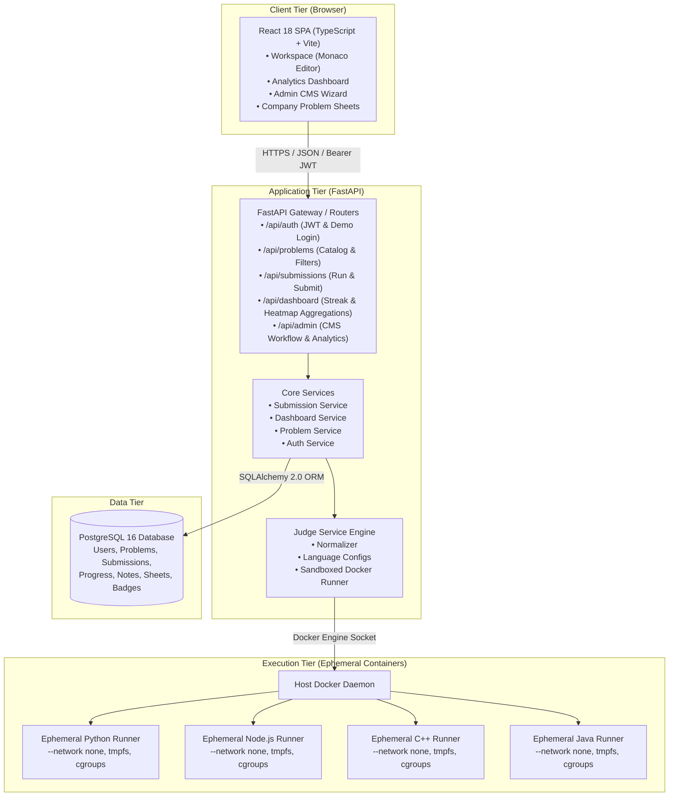

# System Architecture — Code Arena

Code Arena is architected as a decoupled, multi-tier web application consisting of a modern single-page React frontend, a high-throughput FastAPI backend REST API, and an isolated multi-language code-execution sandbox service.

## Architecture Diagram

## Component Responsibilities

1. **Client Tier (React 18 SPA)**:
   - Delivers a rich, multi-panel coding workspace with Monaco Editor, KaTeX math parsing, tabbed problem context, and interactive diagnostics console.
   - Powers the candidate analytics dashboard with SVG GitHub-style streak heatmap and Recharts difficulty/performance graphs.
   - Provides a full-featured Admin CMS wizard for authoring problems, configuring language wrappers, testing sample inputs, and managing publication state.

2. **Application Tier (FastAPI REST API)**:
   - Handles stateless JWT authentication with role-based authorization (`user` vs `admin`) and instantaneous demo logins.
   - Computes query-time aggregations for heatmap activity, streaks, topic mastery, and leaderboard scores.
   - Orchestrates code evaluation against public and hidden test cases.

3. **Execution Tier (Judge Engine)**:
   - Injects user code into per-language execution harnesses.
   - Spawns isolated, resource-limited ephemeral containers with `--network none`, capped CPU/memory, and non-root user permissions.
   - Normalizes JSON test outputs, respecting order-independent matching and float tolerances.
