# Authentication & Authorization Architecture

Code Arena implements a stateless JWT authentication system with role-based access control (`user` and `admin` roles) and instant 1-click demo login accounts for recruiter evaluations.

## Auth Flow Diagram

```mermaid
sequenceDiagram
    autonumber
    actor Client as Browser Client
    participant AuthRouter as /api/auth Router
    participant Security as Security Module (PyJWT + bcrypt)
    participant DB as PostgreSQL DB

    %% Standard Register / Login
    rect rgb(18, 24, 30)
    note right of Client: Standard Registration & Login Flow
    Client->>AuthRouter: POST /api/auth/register (username, email, password)
    AuthRouter->>Security: get_password_hash(password)
    Security-->>AuthRouter: bcrypt hash
    AuthRouter->>DB: INSERT User (role='user', is_demo=false)
    DB-->>AuthRouter: Created User
    AuthRouter->>Security: create_access_token(sub=user.id, role=user.role)
    Security-->>AuthRouter: Signed HS256 JWT
    AuthRouter-->>Client: 200 OK (access_token, user profile)
    end

    %% Demo Login Flow
    rect rgb(20, 32, 24)
    note right of Client: Instant Recruiter Demo Login (Zero Credentials)
    Client->>AuthRouter: POST /api/auth/demo-login { "role": "student" | "admin" }
    AuthRouter->>DB: SELECT User WHERE username = 'demo_student' | 'demo_admin'
    DB-->>AuthRouter: Demo User Record
    AuthRouter->>Security: create_access_token(sub=demo_user.id, role=demo_user.role)
    Security-->>AuthRouter: Signed HS256 JWT
    AuthRouter-->>Client: 200 OK (access_token, demo user profile)
    end

    %% Authenticated API Call
    rect rgb(24, 20, 32)
    note right of Client: Authenticated Protected API Access
    Client->>AuthRouter: GET /api/users/me/dashboard (Header: Bearer <jwt>)
    AuthRouter->>Security: decode_token(jwt)
    Security-->>AuthRouter: Payload { sub: user_id, role: 'user', exp: ... }
    AuthRouter->>DB: SELECT User WHERE id = sub
    DB-->>AuthRouter: Verified User Object
    AuthRouter-->>Client: Authorized Payload
    end
```

## Security Design Highlights
1. **Password Hashing**: Industry-standard bcrypt (`passlib[bcrypt]`) with salt rounds.
2. **Stateless JWTs**: Cryptographically signed access tokens containing user subject ID, role, issued at, and expiration timestamps.
3. **Demo Isolation**: Demo accounts (`demo_student`, `demo_admin`) have `is_demo = true` and are automatically filtered out from public competition leaderboards.
4. **Private Notes Isolation**: Candidate notes enforce strict row-level ownership matching on `user_id` across all operations.
