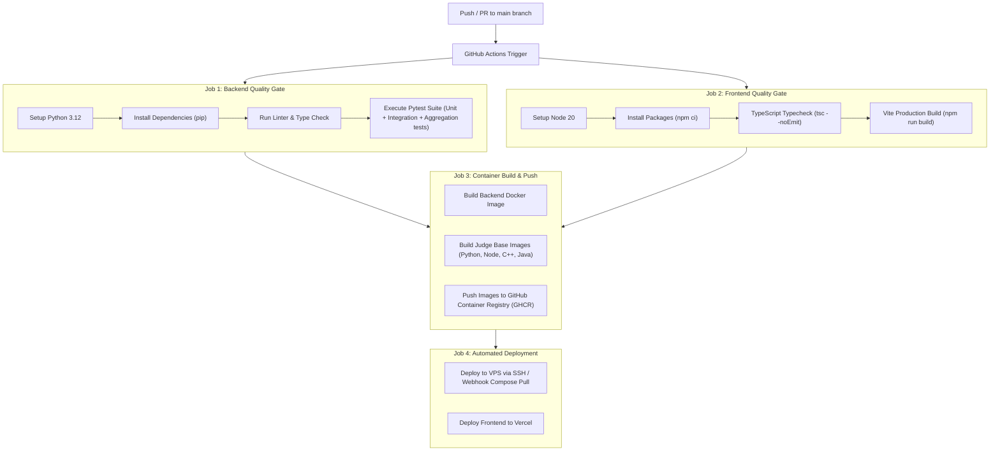

# CI/CD Pipeline Specification — Code Arena

The automated continuous integration and deployment pipeline is orchestrated via GitHub Actions.

## CI/CD Pipeline Workflow

```mermaid
flowchart TD
    Push["Push / PR to main branch"] --> Trigger["GitHub Actions Trigger"]
    
    subgraph Job1 ["Job 1: Backend Quality Gate"]
        B1["Setup Python 3.12"] --> B2["Install Dependencies (pip)"]
        B2 --> B3["Run Linter & Type Check"]
        B3 --> B4["Execute Pytest Suite (Unit + Integration + Aggregation tests)"]
    end

    subgraph Job2 ["Job 2: Frontend Quality Gate"]
        F1["Setup Node 20"] --> F2["Install Packages (npm ci)"]
        F2 --> F3["TypeScript Typecheck (tsc --noEmit)"]
        F3 --> F4["Vite Production Build (npm run build)"]
    end

    subgraph Job3 ["Job 3: Container Build & Push"]
        D1["Build Backend Docker Image"]
        D2["Build Judge Base Images (Python, Node, C++, Java)"]
        D3["Push Images to GitHub Container Registry (GHCR)"]
    end

    Trigger --> Job1
    Trigger --> Job2
    Job1 --> Job3
    Job2 --> Job3

    subgraph Job4 ["Job 4: Automated Deployment"]
        DeployVPS["Deploy to VPS via SSH / Webhook Compose Pull"]
        DeployVercel["Deploy Frontend to Vercel"]
    end

    Job3 --> Job4
```
