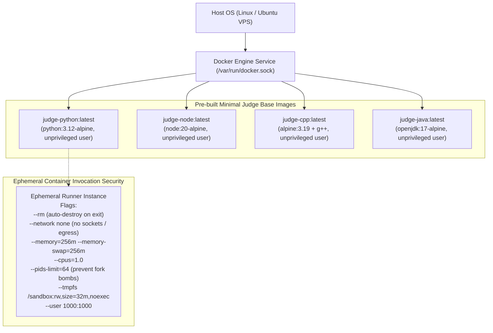

# Docker Architecture & Sandbox Isolation — Code Arena

Code Arena utilizes lightweight, specialized container images to sandbox untrusted code execution.

## Docker Architecture

## Security Constraints Matrix

| Constraint | Enforcement Mechanism | Purpose |
|---|---|---|
| **Network Isolation** | `--network none` | Prevents data exfiltration, port scanning, and outbound network calls |
| **CPU Limit** | `--cpus 1.0` | Prevents CPU starvation on the host machine |
| **Memory Limit** | `--memory 256m --memory-swap 256m` | Prevents memory allocation attacks / OOM crashes |
| **Fork Bomb Protection** | `--pids-limit 64` | Restricts total spawned subprocess threads |
| **Non-Root Execution** | `--user 1000:1000` | Prevents privilege escalation |
| **Volatile Storage** | `--tmpfs /sandbox:rw,size=32m` | Zero disk persistence of user-written temporary binaries |
