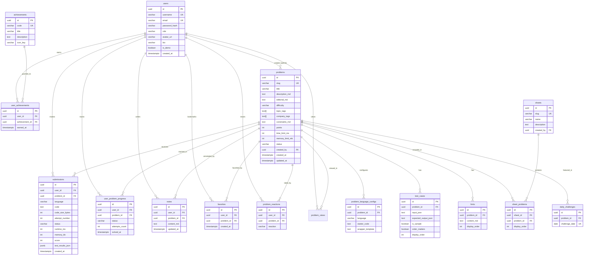

# Entity-Relationship Diagram — Code Arena

This document details the PostgreSQL schema supporting the Code Arena platform.

## ER Diagram

```mermaid
erDiagram
    users ||--o{ submissions : "makes"
    users ||--o{ user_problem_progress : "tracks"
    users ||--o{ notes : "writes"
    users ||--o{ favorites : "bookmarks"
    users ||--o{ problem_reactions : "reacts"
    users ||--o{ problem_views : "views"
    users ||--o{ user_achievements : "earns"
    users ||--o{ problems : "creates (admin)"

    problems ||--o{ problem_language_configs : "configures"
    problems ||--o{ test_cases : "has"
    problems ||--o{ hints : "has"
    problems ||--o{ submissions : "receives"
    problems ||--o{ user_problem_progress : "tracked_in"
    problems ||--o{ notes : "annotated_by"
    problems ||--o{ favorites : "favorited_by"
    problems ||--o{ problem_reactions : "rated_by"
    problems ||--o{ problem_views : "viewed_in"
    problems ||--o{ sheet_problems : "included_in"
    problems ||--o{ daily_challenges : "featured_in"

    sheets ||--o{ sheet_problems : "contains"
    achievements ||--o{ user_achievements : "granted_to"

    users {
        uuid id PK
        varchar username UK
        varchar email UK
        varchar password_hash
        varchar role
        varchar avatar_url
        varchar bio
        boolean is_demo
        timestamptz created_at
    }

    problems {
        uuid id PK
        varchar slug UK
        varchar title
        text description_md
        text editorial_md
        varchar difficulty
        text[] topic_tags
        text[] company_tags
        text constraints_md
        int points
        int time_limit_ms
        int memory_limit_mb
        varchar status
        uuid created_by FK
        timestamptz created_at
        timestamptz updated_at
    }

    problem_language_configs {
        uuid id PK
        uuid problem_id FK
        varchar language
        text starter_code
        text wrapper_template
    }

    test_cases {
        uuid id PK
        uuid problem_id FK
        text input_json
        text expected_output_json
        boolean is_sample
        boolean order_matters
        int display_order
    }

    hints {
        uuid id PK
        uuid problem_id FK
        text content_md
        int display_order
    }

    submissions {
        uuid id PK
        uuid user_id FK
        uuid problem_id FK
        varchar language
        text code
        int code_size_bytes
        int attempt_number
        varchar status
        int runtime_ms
        int memory_kb
        int score
        jsonb test_results_json
        timestamptz created_at
    }

    user_problem_progress {
        uuid id PK
        uuid user_id FK
        uuid problem_id FK
        varchar status
        int attempts_count
        timestamptz solved_at
    }

    notes {
        uuid id PK
        uuid user_id FK
        uuid problem_id FK
        text content_md
        timestamptz updated_at
    }

    favorites {
        uuid id PK
        uuid user_id FK
        uuid problem_id FK
        timestamptz created_at
    }

    problem_reactions {
        uuid id PK
        uuid user_id FK
        uuid problem_id FK
        varchar reaction
    }

    daily_challenges {
        uuid id PK
        uuid problem_id FK
        date challenge_date UK
    }

    sheets {
        uuid id PK
        varchar slug UK
        varchar name
        text description
        uuid created_by FK
    }

    sheet_problems {
        uuid id PK
        uuid sheet_id FK
        uuid problem_id FK
        int display_order
    }

    achievements {
        uuid id PK
        varchar code UK
        varchar title
        text description
        varchar icon_key
    }

    user_achievements {
        uuid id PK
        uuid user_id FK
        uuid achievement_id FK
        timestamptz earned_at
    }
```
