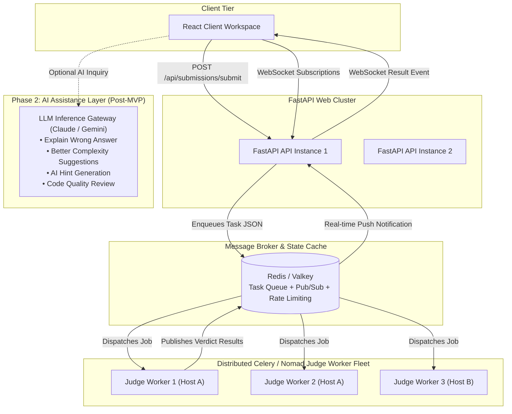

# Future Scaling Roadmap & Phase 2 Architecture — Code Arena

This document outlines the architectural upgrade path from synchronous MVP execution to a distributed, horizontally scalable platform, alongside the Phase 2 AI features layer.

## Distributed Judge Queue Architecture

## Scaling Milestones

1. **Celery + Redis Asynchronous Task Queue**:
   - Replace synchronous judge runner invocations with Celery worker pool.
   - Enables horizontal scaling of judge workers across multiple cloud nodes without blocking FastAPI event loops.

2. **WebSocket Real-time Stream**:
   - Stream test-case-by-test-case execution progress (`Passed 14/25 cases...`) to candidate UI.

3. **Materialized View Caching for Leaderboard**:
   - Cache expensive leaderboard point calculations with hourly PostgreSQL materialized view refreshes.

4. **Phase 2 AI Assistant Layer (Post-MVP)**:
   - **Explain Wrong Answer**: Pinpoint divergence between code logic and failed test cases without spoiling full solutions.
   - **Complexity Optimization Suggestions**: Propose $O(n)$ data structures when $O(n^2)$ code is submitted.
   - **AI Hint Generator**: Scoped hints based on the candidate's partial attempt.
