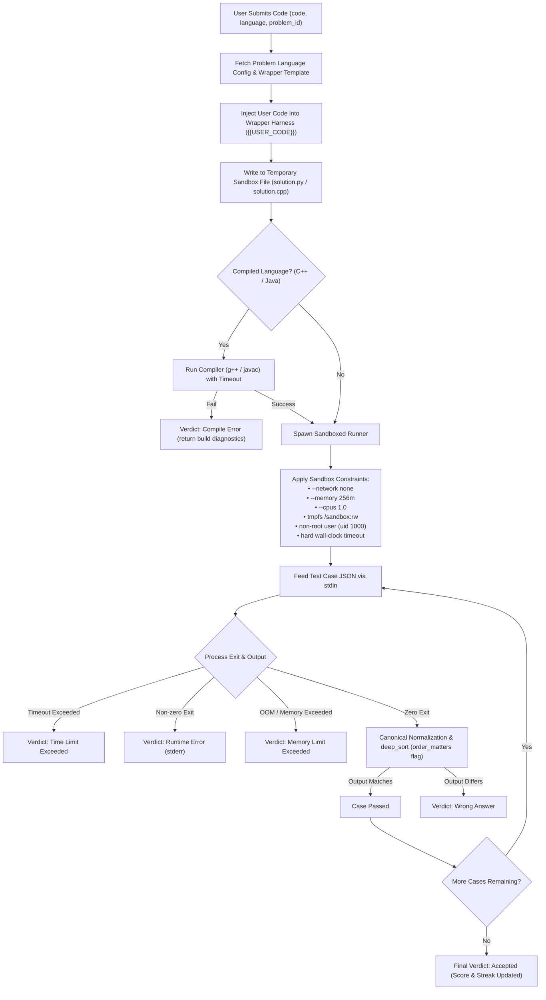

# Code Execution & Judge Pipeline — Code Arena

The Judge Engine safely compiles and executes untrusted user-submitted code in isolated environments.

## Judge Pipeline Lifecycle

## Normalization and Order Independence
For problems such as *Group Anagrams* or *Subsets*, the relative ordering of outer and inner lists may vary across algorithms while remaining strictly correct. The normalizer provides recursive `deep_sort` capability:
- If `order_matters = False`, sublists and dictionaries are canonically sorted prior to equality validation.
- Floating-point outputs are rounded to 6 decimal places to prevent IEEE 754 precision mismatches.
