# Sequence Diagram: Run vs. Submit Flows

In Code Arena, **Run** and **Submit** represent two distinct architectural execution paths:
- **Run (`POST /api/submissions/run`)**: In-memory ephemeral evaluation against sample test cases (or custom user test input) only. Does not persist to the database or modify candidate scores.
- **Submit (`POST /api/submissions/submit`)**: Full evaluation against all public and hidden test cases, records attempt number and code size, persists the submission record, updates user problem progress, streaks, and platform rankings.

## Sequence Diagram

```mermaid
sequenceDiagram
    autonumber
    actor User as Candidate (Browser)
    participant API as FastAPI Backend
    participant DB as PostgreSQL DB
    participant Judge as Judge Runner
    participant Docker as Ephemeral Container

    %% RUN FLOW
    rect rgb(18, 30, 24)
    note right of User: Run Flow (Sample / Custom Tests Only)
    User->>API: POST /api/submissions/run (code, language, problem_id, custom_input?)
    API->>DB: Fetch Problem & Sample Test Cases
    DB-->>API: Problem details, sample cases, language wrapper
    API->>Judge: execute_test_cases(sample_cases, is_run_only=True)
    Judge->>Docker: Launch container (--network none, tmpfs, limits)
    Docker-->>Judge: Return stdout, stderr, runtime_ms, memory_kb
    Judge->>Judge: Output Normalizer comparison
    Judge-->>API: Execution Result (verdict, chips, outputs)
    API-->>User: 200 OK (ExecutionResult JSON — NOT persisted in DB)
    end

    %% SUBMIT FLOW
    rect rgb(20, 24, 36)
    note right of User: Submit Flow (All Cases, Persisted & Scored)
    User->>API: POST /api/submissions/submit (code, language, problem_id)
    API->>DB: Fetch Problem & ALL Test Cases (sample + hidden)
    DB-->>API: All test cases & wrapper template
    API->>Judge: execute_test_cases(all_cases, is_run_only=False)
    loop For each test case
        Judge->>Docker: Spawn ephemeral runner with stdin input
        Docker-->>Judge: stdout / stderr / resource stats
        Judge->>Judge: Normalization & verdict evaluation
    end
    Judge-->>API: Full Test Results & Final Verdict
    API->>DB: Query prior attempts count for user+problem
    API->>DB: INSERT into submissions (verdict, runtime, memory, score, attempt_num, code_size)
    API->>DB: UPSERT user_problem_progress (status='solved'|'attempted', solved_at)
    API->>DB: Check and grant earned achievements (streak, first solve, etc.)
    DB-->>API: Transaction committed
    API-->>User: 200 OK (SubmissionResponse — triggers Confetti on Accepted)
    end
```

